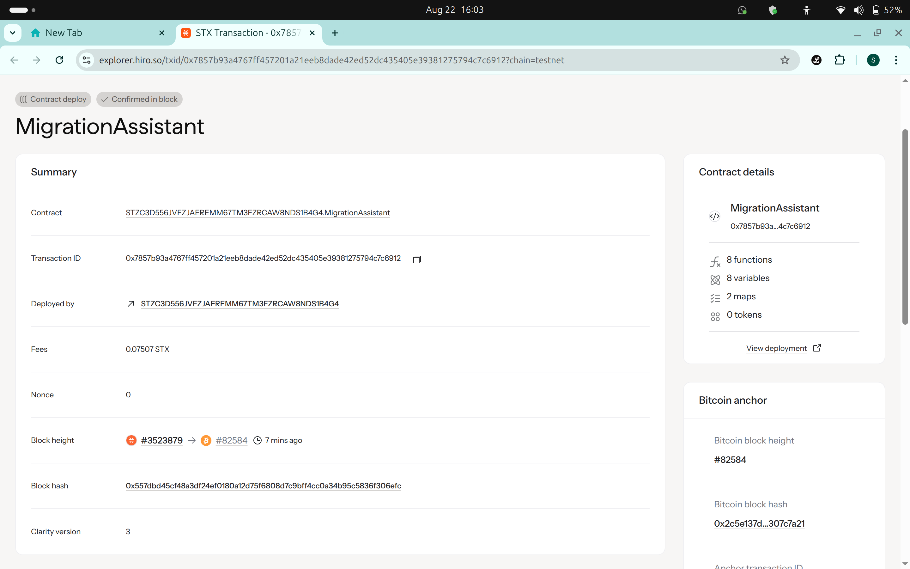

# Migration Assistant

## Project Description

The Migration Assistant is a robust Clarity smart contract designed to facilitate seamless data migration between different contract versions on the Stacks blockchain. This tool provides developers with essential utilities to safely transfer and verify data integrity during contract upgrades, ensuring zero data loss and maintaining system reliability throughout the migration process.

The contract implements two core functions: `migrate-contract-data` for executing data transfers and `verify-migration-integrity` for comprehensive post-migration validation. Built with security and efficiency in mind, it includes comprehensive error handling, access controls, and detailed migration tracking.

## Project Vision

Our vision is to eliminate the complexity and risk associated with smart contract upgrades by providing developers with enterprise-grade migration tools. We aim to:

- **Democratize Contract Upgrades**: Make contract migration accessible to developers of all skill levels
- **Ensure Data Integrity**: Provide bulletproof verification mechanisms to guarantee successful migrations
- **Minimize Downtime**: Enable efficient migrations that reduce service interruptions
- **Build Developer Confidence**: Create reliable tools that developers can trust for critical operations
- **Foster Innovation**: Remove migration barriers that prevent developers from improving their contracts

By standardizing the migration process, we envision a Stacks ecosystem where contract evolution is seamless, secure, and developer-friendly.

## Future Scope

### Phase 1: Enhanced Migration Features
- **Batch Processing**: Support for large-scale data migrations with automatic batching
- **Rollback Mechanisms**: Ability to reverse migrations in case of issues
- **Cross-Chain Migration**: Support for migrating data across different blockchain networks
- **Automated Testing**: Built-in migration simulation and testing capabilities

### Phase 2: Advanced Analytics & Monitoring
- **Real-time Monitoring**: Live dashboard for tracking migration progress
- **Performance Metrics**: Detailed analytics on migration speed and success rates
- **Audit Trail**: Comprehensive logging for compliance and debugging
- **Alert System**: Automated notifications for migration status updates

### Phase 3: Ecosystem Integration
- **DeFi Protocol Support**: Specialized migration tools for DeFi applications
- **NFT Migration**: Dedicated features for migrating NFT collections and metadata
- **Multi-Contract Orchestration**: Coordinate migrations across multiple related contracts
- **Third-party Integrations**: APIs for popular Stacks development tools

### Phase 4: Enterprise Solutions
- **Governance Integration**: DAO-controlled migration processes
- **Permission Management**: Role-based access for enterprise environments
- **Compliance Tools**: Built-in features for regulatory requirements
- **Professional Support**: Managed migration services for enterprise clients

### Long-term Vision
- **Industry Standard**: Establish Migration Assistant as the go-to solution for Stacks contract upgrades
- **Community Ecosystem**: Foster a community of contributors and plugin developers
- **Educational Resources**: Comprehensive documentation, tutorials, and best practices
- **Research & Development**: Continuous innovation in blockchain migration techniques

## Core Functions

### 1. `migrate-contract-data`
Transfers data from an old contract version to a new contract version with full validation and tracking.

**Parameters:**
- `old-contract`: Principal of the source contract
- `new-contract`: Principal of the destination contract  
- `data-keys`: List of data keys to migrate
- `data-values`: List of corresponding data values

**Features:**
- Owner-only access control
- Data integrity validation
- Migration status tracking
- Comprehensive error handling

### 2. `verify-migration-integrity`
Performs thorough verification of completed migrations to ensure data integrity and completeness.

**Parameters:**
- `old-contract`: Principal of the source contract
- `new-contract`: Principal of the destination contract
- `verification-keys`: List of keys to verify

**Returns:**
- Migration status and timestamp
- Verification completeness score
- Detailed integrity metrics

## Technical Specifications

- **Language**: Clarity
- **Platform**: Stacks Blockchain
- **Access Control**: Owner-restricted for critical functions
- **Data Storage**: Efficient map-based storage for migration records
- **Error Handling**: Comprehensive error constants and validation

## Contract Address Details
STZC3D556JVFZJAEREMM67TM3FZRCAW8NDS1B4G4.MigrationAssistant

---
